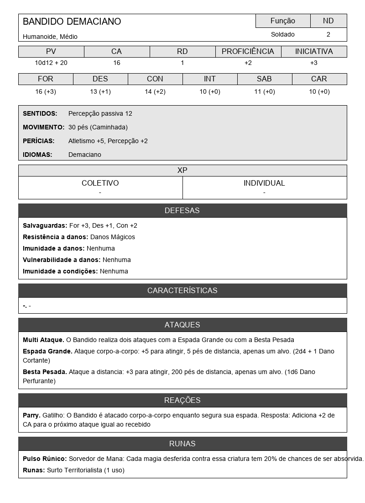

# Gerador de Ficha de Criatura para Runarcana

Bem-vindo! Este projeto é uma ferramenta simples para criar fichas de criaturas para o RPG de mesa Runarcana. Ele pega as informações que você define em um arquivo de texto (`Dados.json`) e gera uma imagem (`.png`) da ficha, pronta para ser usada em suas mesas.

Este guia foi feito para pessoas que não têm experiência com programação. Vamos passar por cada passo em detalhes!

---

## O que você precisa saber antes de começar

### O que é o Terminal (CMD ou Prompt de Comando)?

O Prompt de Comando (que vamos chamar de CMD) é uma ferramenta do Windows que permite que você dê comandos diretamente ao seu computador usando texto, em vez de cliques do mouse. Nós o usaremos para instalar o que nosso script precisa e para executá-lo.

**Como abrir o CMD:**

1.  Clique no menu Iniciar do Windows (o ícone do Windows no canto inferior esquerdo).
2.  Digite `cmd` ou `Prompt de Comando`.
3.  Clique no aplicativo "Prompt de Comando" que aparecerá na busca. Uma janela preta com texto branco será aberta. É aqui que você vai digitar os comandos dos próximos passos.

---

## Passo 1: Instalar o Python

Python é a linguagem de programação em que o nosso script foi escrito. O seu computador precisa "entender" Python para poder executar o gerador de fichas.

1.  **Baixe o Python:**
    *   Acesse o site oficial do Python: [https://www.python.org/downloads/](https://www.python.org/downloads/)
    *   Clique no botão amarelo para baixar a versão mais recente para Windows.

2.  **Instale o Python (Este passo é MUITO IMPORTANTE!):**
    *   Execute o arquivo que você baixou.
    *   Na primeira tela da instalação, **marque a caixa que diz "Add Python to PATH"** na parte de baixo da janela. Isso é crucial para que os comandos funcionem no CMD.
    *   Depois de marcar a caixa, clique em "Install Now".
    *   Aguarde a instalação terminar e pode fechar a janela.


---

## Passo 2: Baixar os arquivos do projeto

Agora você precisa dos arquivos deste projeto (o script, o arquivo de dados, etc.).

1.  Vá para a página principal do projeto no GitHub (o site onde você está lendo isso).
2.  Clique no botão verde escrito "<> Code".
3.  No menu que aparecer, clique em "Download ZIP".
4.  Um arquivo `.zip` será baixado para o seu computador (geralmente na pasta "Downloads").
5.  Encontre o arquivo, clique com o botão direito sobre ele e escolha "Extrair tudo..." ou "Unzip". Isso criará uma pasta com todos os arquivos do projeto.

---

## Passo 3: Instalar a biblioteca "Pillow"

Nosso script precisa de uma "ajudante" para poder criar e manipular imagens. Essa ajudante se chama "Pillow". Vamos instalá-la usando o CMD.

1.  **Navegue até a pasta do projeto no CMD:**
    *   Primeiro, abra a pasta do projeto que você extraiu no passo anterior.
    *   Clique na barra de endereço na parte de cima da janela do Windows Explorer para revelar o caminho da pasta (algo como `C:\Users\SeuNome\Downloads\runarcana-gerador-ficha-criatura`).
    *   Copie esse caminho (Ctrl+C).
    *   Agora, volte para o CMD que você abriu. Digite `cd ` (o comando `cd` seguido de um espaço) e cole o caminho que você copiou (para colar no CMD, você pode simplesmente clicar com o botão direito do mouse). O comando deve ficar assim:
        ```
        cd C:\Users\SeuNome\Downloads\runarcana-gerador-ficha-criatura
        ```
    *   Pressione Enter. Agora o seu CMD está "dentro" da pasta do projeto.

2.  **Instale o Pillow:**
    *   Com o CMD ainda aberto e dentro da pasta correta, digite o seguinte comando e pressione Enter:
        ```
        pip install Pillow
        ```
    *   `pip` é o gerenciador de pacotes do Python. Este comando baixa e instala o Pillow automaticamente. Espere até que o processo termine.

---

## Passo 4: Edite os dados da sua criatura

Toda a informação da criatura que você quer criar está no arquivo `Dados.json`.

1.  Abra o arquivo `Dados.json` com um editor de texto simples, como o **Bloco de Notas**.
2.  Você verá uma estrutura com "chaves" e "valores". As chaves estão à esquerda dos dois pontos (`:`), e os valores à direita.
3.  **VOCÊ SÓ DEVE MUDAR OS VALORES** (o texto à direita dos dois pontos, que está entre aspas). Não apague as aspas e não mude o texto das chaves (à esquerda).

    *   **Exemplo RUIM (não faça isso):**
        `"nome": "Dragão Vermelho"` -> `NomeDoMonstro: "Dragão Vermelho"` (A chave `"nome"` foi alterada).

    *   **Exemplo BOM (faça isso):**
        `"nome": "Bandido Demaciano"` -> `"nome": "Pássaro Bico-de-Serra"` (Apenas o valor foi alterado).

4.  Altere todos os atributos da criatura conforme desejar e salve o arquivo.

---

## Passo 5: Gere a sua ficha!

Agora que tudo está pronto, vamos executar o script.

1.  Volte para o CMD (que já deve estar na pasta correta).
2.  Digite o seguinte comando e pressione Enter:
    ```
    python GerarFichaCriatura.py
    ```
3.  Isso diz ao Python para executar o nosso script. Em alguns segundos, uma nova imagem `.png` com o nome da sua criatura (por exemplo, `Ficha-Pássaro-Bico-de-Serra.png`) aparecerá na mesma pasta do projeto.

Pronto! Sua ficha de criatura foi gerada. Você pode repetir os passos 4 e 5 para criar quantas criaturas quiser.

---

## Exemplo de Ficha Gerada

Aqui está um exemplo de como a ficha da criatura ficará depois de gerada, usando os dados padrão que vêm com o projeto:


